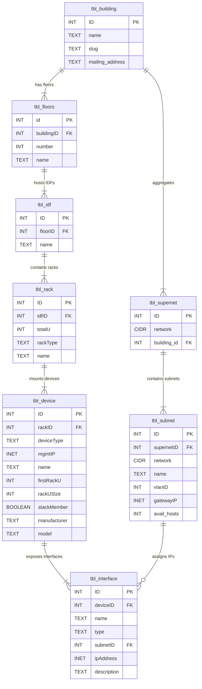

# Visual Subnet Planner Database Schema

```mermaid
erDiagram
    tbl_building {
        INT ID PK
        TEXT name
        TEXT slug
        TEXT mailing_address
    }
    tbl_floors {
        INT id PK
        INT buildingID FK
        INT number
        TEXT name
    }
    tbl_idf {
        INT ID PK
        INT floorID FK
        TEXT name
    }
    tbl_rack {
        INT ID PK
        INT idfID FK
        INT totalU
        TEXT rackType
        TEXT name
    }
    tbl_device {
        INT ID PK
        INT rackID FK
        TEXT deviceType
        INET mgmtIP
        TEXT name
        INT firstRackU
        INT rackUSize
        BOOLEAN stackMember
        TEXT manufacturer
        TEXT model
    }
    tbl_interface {
        INT ID PK
        INT deviceID FK
        TEXT name
        TEXT type
        INT subnetID FK
        INET ipAddress
        TEXT description
    }
    tbl_subnet {
        INT ID PK
        INT supernetID FK
        CIDR network
        TEXT name
        INT vlanID
        INET gatewayIP
        INT avail_hosts
    }
    tbl_supernet {
        INT ID PK
        CIDR network
        INT building_id FK
    }

    tbl_building ||--|{ tbl_floors : "has floors"
    tbl_floors ||--|{ tbl_idf : "hosts IDFs"
    tbl_idf ||--|{ tbl_rack : "contains racks"
    tbl_rack ||--|{ tbl_device : "mounts devices"
    tbl_device ||--|{ tbl_interface : "exposes interfaces"
    tbl_building ||--|{ tbl_supernet : "aggregates"
    tbl_supernet ||--|{ tbl_subnet : "contains subnets"
    tbl_subnet ||--o{ tbl_interface : "assigns IPs"
```
